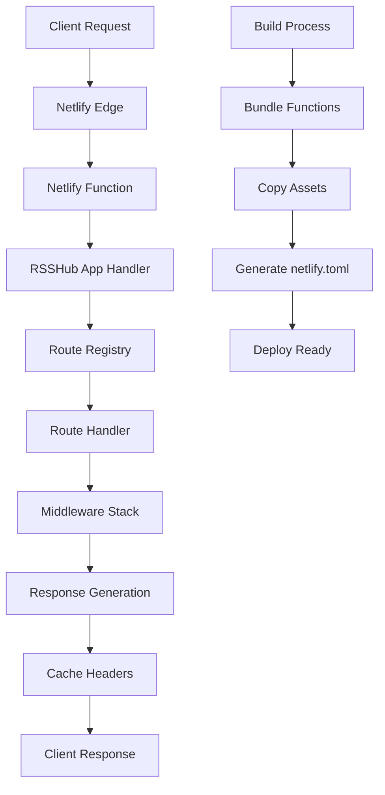

# Design Document

## Overview

This design adapts RSSHub for deployment on Netlify Functions by creating a serverless architecture that leverages RSSHub's existing Hono-based application structure. The solution builds upon the existing Vercel deployment pattern while addressing Netlify-specific requirements such as function file structure, build processes, and platform constraints.

## Architecture

### High-Level Architecture



### Function Architecture

The design uses a single Netlify Function that handles all RSSHub routes, similar to the Vercel approach but adapted for Netlify's function structure:

1. **Single Function Handler**: One main function file that imports the RSSHub app
2. **Dynamic Route Resolution**: Leverage Hono's routing to handle all paths within the function
3. **Middleware Preservation**: Maintain all existing middleware functionality
4. **Asset Serving**: Handle static assets through Netlify's static file serving

## Components and Interfaces

### 1. Netlify Function Handler

**File**: `netlify/functions/rsshub.ts`

```typescript
interface NetlifyEvent {
  path: string;
  httpMethod: string;
  headers: Record<string, string>;
  queryStringParameters: Record<string, string> | null;
  body: string | null;
  isBase64Encoded: boolean;
}

interface NetlifyResponse {
  statusCode: number;
  headers: Record<string, string>;
  body: string;
  isBase64Encoded?: boolean;
}

type NetlifyHandler = (event: NetlifyEvent, context: any) => Promise<NetlifyResponse>;
```

### 2. Build Configuration

**File**: `tsdown-netlify.config.ts`

Similar to the Vercel config but optimized for Netlify:
- Single entry point for the function
- Bundle optimization for serverless constraints
- Asset copying for static files

### 3. Netlify Configuration

**File**: `netlify.toml`

```toml
[build]
  command = "pnpm build:netlify"
  functions = "netlify/functions"
  publish = "netlify/static"

[functions]
  directory = "netlify/functions"

[[redirects]]
  from = "/api/*"
  to = "/.netlify/functions/rsshub"
  status = 200

[[redirects]]
  from = "/*"
  to = "/.netlify/functions/rsshub"
  status = 200

[functions.rsshub]
  timeout = 30
```

### 4. Request Adapter

**Component**: `NetlifyRequestAdapter`

Converts Netlify event format to standard Request objects that Hono can process:

```typescript
class NetlifyRequestAdapter {
  static eventToRequest(event: NetlifyEvent): Request
  static responseToNetlify(response: Response): Promise<NetlifyResponse>
}
```

## Data Models

### Environment Configuration

The existing RSSHub configuration system will be preserved, with Netlify-specific environment variables:

```typescript
interface NetlifyConfig extends Config {
  netlify: {
    functionTimeout: number;
    maxMemory: number;
    enableEdgeCaching: boolean;
  };
}
```

### Function Context

```typescript
interface FunctionContext {
  requestId: string;
  remainingTimeInMillis: number;
  functionName: string;
  functionVersion: string;
}
```

## Error Handling

### 1. Timeout Management

- Implement request timeout monitoring
- Graceful degradation when approaching Netlify's 30-second limit
- Early termination with partial results when necessary

### 2. Memory Management

- Monitor memory usage during route processing
- Implement garbage collection hints for large operations
- Fallback mechanisms for memory-intensive routes

### 3. Cold Start Optimization

- Minimize initialization code in the function handler
- Lazy loading of route modules
- Efficient bundling to reduce function size

### 4. Error Response Handling

```typescript
interface ErrorResponse {
  error: string;
  message: string;
  statusCode: number;
  requestId: string;
  timestamp: string;
}
```

## Testing Strategy

### 1. Unit Testing

- Test Netlify event to Request conversion
- Test Response to Netlify response conversion
- Test configuration loading in serverless environment

### 2. Integration Testing

- Test complete request flow through Netlify function
- Test route resolution and middleware execution
- Test error handling scenarios

### 3. Performance Testing

- Test cold start performance
- Test memory usage under load
- Test timeout behavior with slow routes

### 4. Local Development Testing

- Netlify CLI integration for local testing
- Mock Netlify environment for development
- Hot reload support during development

## Build Process Design

### 1. Build Script

**Command**: `pnpm build:netlify`

**Process**:
1. Run route building (`tsx scripts/workflow/build-routes.ts`)
2. Bundle application with Netlify-specific config (`tsdown --config ./tsdown-netlify.config.ts`)
3. Generate Netlify function wrapper
4. Copy static assets to netlify/static
5. Generate netlify.toml configuration
6. Create deployment-ready package

### 2. Bundle Optimization

- Tree-shake unused dependencies
- Minimize function bundle size
- Optimize for fast cold starts
- Include only necessary assets

### 3. Asset Management

- Static assets served by Netlify's CDN
- Dynamic asset generation through functions when needed
- Proper cache headers for static content

## Caching Strategy

### 1. Netlify CDN Caching

- Leverage Netlify's edge caching for RSS feeds
- Set appropriate cache headers based on route configuration
- Implement cache invalidation strategies

### 2. Function-Level Caching

- In-memory caching for frequently accessed data
- Redis fallback when available (external service)
- Cache warming strategies for popular routes

### 3. Cache Configuration

```typescript
interface CacheConfig {
  defaultTTL: number;
  maxAge: number;
  staleWhileRevalidate: number;
  cacheControl: string;
}
```

## Deployment Considerations

### 1. Environment Variables

- Migrate all existing RSSHub environment variables
- Add Netlify-specific configuration
- Secure handling of sensitive credentials

### 2. Function Constraints

- **Timeout**: 30 seconds maximum (Netlify Pro: 15 minutes)
- **Memory**: 1008 MB maximum
- **Bundle Size**: 50 MB unzipped maximum
- **Concurrent Executions**: 1000 default limit

### 3. Monitoring and Observability

- Netlify function logs integration
- Performance monitoring
- Error tracking and alerting
- Usage analytics

## Security Considerations

### 1. Input Validation

- Validate all incoming requests
- Sanitize query parameters and headers
- Rate limiting through Netlify's built-in features

### 2. Environment Security

- Secure environment variable handling
- No sensitive data in function bundles
- Proper CORS configuration

### 3. Access Control

- Maintain existing RSSHub access control mechanisms
- Leverage Netlify's security features
- API key validation for protected routes